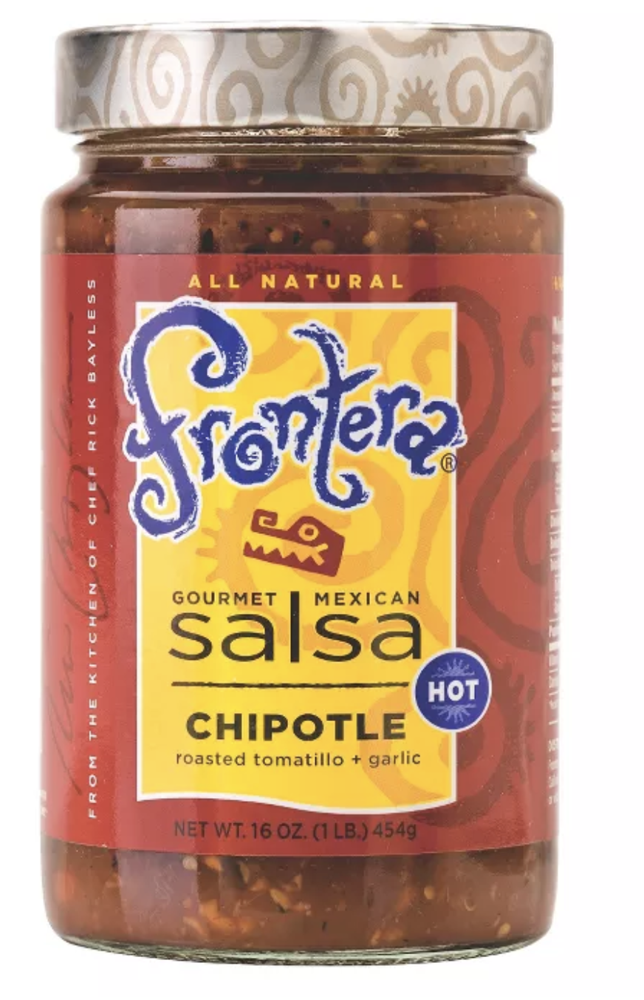

# Chipotle Meal

#### This is an EZPZ DIY Chipotle recipe after many iterations of getting it as close to the real deal as possible. I was able to procure ingredients for this due to chipotle being very "open" about their ingredients. \*\* The rice steps is copy pasted based on a highly rated recipe.

### Optional ingredients to procure is sour cream/cheese/corn if you fancy them

# Pre cooking prep

## For the marinade (chicken or steak)

#### Ingredients

- 4 cloves garlic
- 7 oz adobo sauce whole can (You can find thes in the HISPANIC Isle of any store called [CHIPOTLE PEPPERS IN ADOBO SAUCE]
- 2 tablespoons olive oil
- 2 teaspoons cumin powder
- 2 teaspoons dried oregano
- Salt and ground black pepper
- 2 teaspoon dried Ancho Chilli power(optional since its hard to find)

#### Instructions

- Blend all of these ingredients in the blender (make sure you have enough salt).
- In a mixing bowl, mix in 4-5 chicken breasts/steak let it marinate minimum 4 hours to a whole day.

## Sauce

I only have the hot sauce version.
I used to make this from scratch by roasting tomatillos/garlic in the oven and boiling them. It's a long arduous process.

Here is an EZPZ option. Buy this from Target!

[Frontera roasted tomatillo garlic salsa](https://www.target.com/p/frontera-chipotle-salsa-16-oz/-/A-14907536)

#### Ingredients

- Frontera tomatillo salsa
- plain old cheap hot sauce
- salt(if you want)

#### Instructions

- Into a container, pour in a good amount of salsa you want for chipotle.
- Pour in a good amount of hot sauce(till you feel you like the acidity of the resulting mixture)
- Add any extra salt you feel like

---

# Time of cooking

## Rice

(https://github.com/chasexd/Recipes/tree/master/Basmati%20Rice)[Follow this instant pot rice recipe]
after you are done cooking it, get some soy oil/rice bran oil/canola oil to mix with your rice.
Add in lime juice/lemon juice and chopped cilantro.

---

## Beans and Veggies

This is upto you if you like beans of veggies.
I do with store bought canned black beans or pinto beans
As for veggies you can do with sautéed chopped green peppers/red onions

---

## Guac

Again this is all upto your preference, there will be plenty left over for your tortilla chips for later

#### Ingredients

- 3 Avocados
- 1 lime
- salt and pepper
- 1 Jalepeno
- A little bit of chopped cilantro
- a bit of minced red onion

#### Instructions

- Well mix them in a bowl

## Cooking chicken/steak

You can grill them or bake them but as long as it reaches optimal cooked interal temp, you are good!

#### Serve as a bowl or make a burrito with large enough tortillas

- If you like a soft gummy tortilla like chipotle, you can buy [this](https://www.walmart.com/ip/Old-El-Paso-Restaurant-Grande-Shells-6-Count-21-5-oz/43310156)

#### You can freeze every single of the recipe component for meal prepping. Onions don't freeze nicely, so thats the only con.
